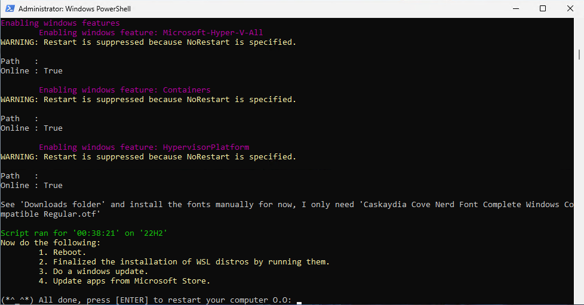

# ❓What the heck is this

Install apps and preliminary setup mainly for dev work on a new `Windows 11(22H2)` machine(bare metal or VM).

>For your own sanity please review the pwsh script!!!

This script will:

- Install WSL 2
  - Ubuntu and Kali
- Installs apps primarily using `winget`
  - See [winget-packages][wingetpac] for list of apps to be installed
- Installs apps from `chocolatey` because they are not on `winget` yet
- Installs pwsh modules
- Development tools
- Enabling Windows Features
- Setup few basic git alias
- Downloads Cascadia Nerd Font, install is manual for now.
- Removes pre-loaded apps that I don't need
- Creates folders
  - repos🧑‍💻, games🎮, temp



> On a descent machine and internet connection this usually takes around 35-45 minutes.

## 🔰Gettings started

Prerequisites:

- `Windows PowerShell 5.1`, this is the installed version on `Win11-22H2`
- `winget`, do a Windows Store App update first so you got the latest, tested on `v1.3`

Fire up an elevated powershell and run:

```pwsh
iwr -Uri 'https://raw.githubusercontent.com/ronnelsantiago/new-win11-machine/main/winget-packages.json' -OutFile winget-packages.json; iex ((new-object net.webclient).DownloadString('https://raw.githubusercontent.com/ronnelsantiago/new-win11-machine/main/new-win11.ps1'))
```

Running it will:

- download the `winget-packages.json` file
- run the pwsh script `new-win11.ps1`

## 🧑‍💻Apps to be installed

```text
7zip.7zip
Amazon.AWSCLI
Atlassian.Sourcetree
baretail
BleachBit.BleachBit
Brave.Brave
Canonical.Ubuntu.2204
Chocolatey.ChocolateyGUI
CoreyButler.NVMforWindows
Docker.DockerDesktop
Git.Git
GitHub.cli
GitHub.GitHubDesktop
GoLang.Go
Google.Chrome
Hashicorp.Vagrant
JanDeDobbeleer.OhMyPosh
JetBrains.Toolbox
kalilinux.kalilinux
LINQPad.LINQPad.7
Microsoft.AzureCLI
Microsoft.Azure.CosmosEmulator
Microsoft.AzureDataStudio
Microsoft.Azure.StorageEmulator
Microsoft.Azure.StorageExplorer
Microsoft.Edge.Dev
Microsoft.Office
Microsoft.OpenJDK.17
Microsoft.PowerShell
Microsoft.PowerToys
Microsoft.SQLServerManagementStudio
Microsoft.Teams
Microsoft.VisualStudio.2022.Community
Microsoft.VisualStudio.2022.Professional
Microsoft.VisualStudioCode
Microsoft.VisualStudioCode.Insiders
Microsoft.WindowsTerminal.Preview
Mozilla.Firefox
NickeManarin.ScreenToGif
Notepad++.Notepad++
OpenWhisperSystems.Signal
Oracle.VirtualBox
paint.net
Postman.Postman
PuTTY.PuTTY
REALiX.HWiNFO
RescueTime.DesktopApp
SlackTechnologies.Slack
smtp4dev
Sysinternals Suite
Telerik.Fiddler.Classic
VMware.WorkstationPlayer
Yarn.Yarn
Yubico.YubikeyManager
```

## 📚References

- https://github.com/tathamoddie/New-Machine.ps1
- https://github.com/matt9ucci/DockerCompletion
- https://github.com/PowerShell/PSReadLine/blob/master/PSReadLine/SamplePSReadLineProfile.ps1#L13-L21

### 🗒️Notes

- PSReadline now installed by default on pwsh 7.3
- `winget export -o myExportedWingetApps.json`

[wingetpac]: /winget-packages.json
